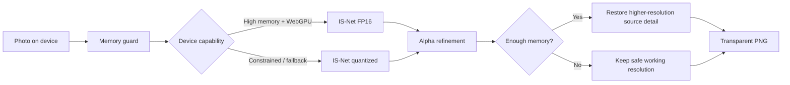

<p align="center">
  
</p>

<h1 align="center">FlytheBG</h1>

<p align="center"><strong>Private browser-side background removal + passport photo tools.</strong></p>

<p align="center">
  <a href="https://github.com/StackPilotMAX/FlytheBG/actions/workflows/ci.yml"></a>
  
  
  
</p>

<p align="center">
  
</p>

FlytheBG removes image backgrounds locally in the visitor's browser, exports transparent PNGs, and builds print-ready passport-photo sheets. The current production image path does **not require a FlytheBG inference server, database, paid GPU, or model API key**.

> ⭐ If FlytheBG is useful to you, starring the repository is the easiest way to support the project and help other people discover it.

## What makes FlytheBG different?

- **Browser-side AI** — the current background-removal pipeline runs on the visitor's device.
- **No paid inference backend required** — there is no Render/GPU image-processing service in the current architecture.
- **Adaptive local inference** — capable WebGPU devices can try FP16 while constrained devices use a smaller quantized path with CPU/WASM fallback.
- **Low-memory guards** — oversized working images can be reduced before inference on budget phones.
- **Alpha refinement** — lightweight local cleanup can reduce faint speckles and tiny pinholes in the generated transparency mask.
- **Source-detail restoration** — eligible devices can reapply a refined mask to higher-resolution source detail.
- **Any normal aspect ratio** — portrait, landscape, square, vertical, and panoramic inputs are not forced into a square.
- **Passport Photo Maker** — exact physical dimensions, DPI-aware sheets, per-copy manual positioning, direct printing, and PNG export.
- **Cinematic landing page** — a single full-screen looping landscape video with glass navigation and product-focused hero copy.
- **Instrument Serif + Inter** — loaded through `next/font` and self-hosted with the built application.
- **Accessible FAQs on tool pages** — desktop hover opens the focused item while native tap and keyboard interaction remains available.

## Homepage design

The homepage intentionally uses one full-viewport hero instead of a long marketing page. Its visual direction comes from a supplied motion reference while the visible wording is original to FlytheBG.

The hero includes:

- a looping full-screen landscape MP4;
- a small centered translucent navigation pill;
- the FlytheBG geometric chevron mark;
- direct tabs for Remove BG, Passport, Security, and About;
- an Instrument Serif editorial headline;
- Inter body copy and controls;
- one clear CTA into the actual remover.

The MP4 is referenced from the public CloudFront URL supplied for the project instead of storing a large video binary in Git. This keeps clones and repository history lightweight.

## Passport Photo Maker

The passport tool supports both fast master framing and individual copy editing:

1. choose exact physical dimensions such as 35 × 45 mm or 2 × 2 in;
2. remove the background locally or keep the original;
3. set a master crop and zoom;
4. build the print sheet;
5. select any individual photo in the final preview;
6. drag only that copy without moving the others;
7. scroll over the selected copy to adjust only its zoom;
8. use arrow nudges for fine positioning;
9. reset one copy or copy the master framing back to it;
10. **Print directly at Actual Size / 100%** or **Download PNG**.

Per-photo adjustments are included in both printing and PNG export.

## Browser AI pipeline



The current runtime can use:

- bundled `@imgly/background-removal`;
- WebGPU where available;
- CPU/WASM fallback;
- a browser-safe ESM runtime fallback for common worker/WASM initialization failures.

Alpha cleanup is conservative post-processing, not another AI model. It cannot recreate foreground pixels the segmentation model never detected.

## Low-memory behavior

Approximate maximum inference working edge:

| Reported device memory | Working edge guard |
| --- | ---: |
| ≤ 2 GB | 1400 px |
| ≤ 4 GB | 1800 px |
| ≤ 6 GB | 2400 px |
| Higher | No automatic edge reduction from this guard |

This improves reliability but cannot guarantee that every enormous image will succeed on every low-end phone. Browser memory, open tabs, image dimensions, browser version, and device hardware still matter.

## $0 image-compute architecture

FlytheBG is a **Next.js static export**. The current image tools do not require:

- a Render web service;
- server-side image inference;
- a paid GPU;
- Supabase or another image database;
- object storage for user photos;
- a model API key;
- a Python background-removal server.

The production output is static HTML/CSS/JavaScript in `apps/web/out`. A hosting provider can still charge if an account owner chooses a paid plan or exceeds that provider's free limits; the FlytheBG code itself does not require paid image-compute infrastructure.

## Run locally

Requirements:

- Node.js 22
- npm
- a modern WebAssembly-capable browser
- WebGPU optional

```bash
git clone https://github.com/StackPilotMAX/FlytheBG.git
cd FlytheBG
npm install
npm run dev:web
```

Open `http://localhost:3000`.

Production checks:

```bash
npm run test:web
npm run typecheck:web
npm run build:web
```

Static output:

```text
apps/web/out
```

## Safe public configuration

Copy `.env.example` to a local environment file when needed.

```text
NEXT_PUBLIC_SITE_URL=http://localhost:3000
NEXT_PUBLIC_APP_NAME=FlytheBG
NEXT_PUBLIC_UPLOAD_MAX_MB=12
NEXT_PUBLIC_CONTACT_EMAIL=
NEXT_PUBLIC_ADSENSE_CLIENT=
NEXT_PUBLIC_GOOGLE_SITE_VERIFICATION=
NEXT_PUBLIC_BING_SITE_VERIFICATION=
```

### ⚠️ Never put secrets in `NEXT_PUBLIC_*`

Every `NEXT_PUBLIC_*` value is compiled into browser-visible JavaScript and must be treated as public. Never commit or expose passwords, OTPs, private API keys, database credentials, service-role credentials, hosting tokens, session cookies, recovery codes, private signing keys, or personal data you do not intend to publish.

`.env*` files are ignored except the deliberately safe `.env.example`. See [SECURITY.md](SECURITY.md) for the project security policy.

## Repository structure

```text
FlytheBG/
├─ apps/web/
│  ├─ public/                 # Brand/static assets
│  ├─ src/app/                # Routes, metadata, hero + styles
│  ├─ src/components/         # Remover, passport editor, shared UI
│  ├─ src/lib/                # Browser AI + validation
│  └─ tests/                  # Regression checks
├─ .github/workflows/         # CI
├─ .github/ISSUE_TEMPLATE/    # Privacy-safe issue templates
├─ CONTRIBUTING.md
├─ SECURITY.md
├─ SUPPORT.md
└─ README.md
```

## Google Search Console

After production deployment:

1. verify the `flythebg.com` property;
2. inspect `https://flythebg.com/` and request indexing after important changes;
3. submit `https://flythebg.com/sitemap.xml`;
4. review Page Indexing for canonical or crawl issues;
5. confirm `/icon.svg`, `/robots.txt`, and `/sitemap.xml` load publicly.

FlytheBG includes focused metadata for terms such as `free background remover`, `remove background online`, `transparent PNG maker`, `passport photo maker`, and the brand variants `FlytheBG` / `Fly the BG`. Metadata describes the product but cannot guarantee a search ranking.

## Privacy and security

The intended production architecture keeps image processing browser-side. Source photos and generated image blobs should not be added to an upload API, analytics payload, database, storage bucket, ad request, or error report without an explicit privacy/security review.

Please read:

- [Security Policy](SECURITY.md)
- [Support](SUPPORT.md)
- [Contributing](CONTRIBUTING.md)
- the in-app Privacy & AI page
- the in-app Terms and Cookie pages

## Contributing

Bug fixes, browser-compatibility improvements, accessibility work, tests, documentation, performance optimization, and careful image-processing improvements are welcome.

Before submitting a PR:

```bash
npm run test:web
npm run typecheck:web
npm run build:web
```

Please never attach sensitive personal photos or credentials to a public issue.

## Third-party software

FlytheBG integrates `@imgly/background-removal`, ONNX Runtime Web, Next.js, React, Three.js, Instrument Serif, and Inter. Review and comply with upstream licenses/terms when redistributing or operating the project. Instrument Serif and Inter are used through their Google Fonts/open-font distribution and are self-hosted by the Next.js build.

## Support

A public support address is **not hard-coded into the repository**. A deployer can intentionally publish one using `NEXT_PUBLIC_CONTACT_EMAIL`. Remember that value becomes public once configured.
