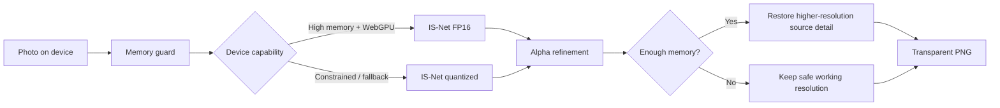

<p align="center">
  
</p>

<h1 align="center">FlytheBG</h1>

<p align="center"><strong>Private, browser-side AI background removal + passport photo tools.</strong></p>

<p align="center">
  <a href="https://github.com/StackPilotMAX/FlytheBG/actions/workflows/ci.yml"></a>
  
  
  
</p>

<p align="center">
  
</p>

FlytheBG removes image backgrounds locally in the visitor's browser, exports transparent PNGs, crops results, and builds print-ready passport-photo sheets. The production image path does **not require a FlytheBG inference server, database, GPU instance, or model API key**.

> ⭐ If FlytheBG is useful to you, starring the repository is the easiest way to support the project and help other people discover it.

## Why FlytheBG?

- **Private by architecture** — working photos stay in browser memory during image processing.
- **No paid inference backend required** — AI inference runs on the visitor's device.
- **Adaptive local AI** — capable WebGPU devices can try FP16; constrained devices use a smaller quantized path with CPU/WASM fallback.
- **Low-memory protection** — oversized working images can be reduced before inference on budget phones.
- **Alpha refinement** — lightweight local mask cleanup can reduce faint speckles and tiny pinholes.
- **Source-detail restoration** — eligible devices can reapply a refined segmentation mask to higher-resolution source detail.
- **Any normal aspect ratio** — portrait, landscape, square, vertical, and panorama inputs are not forced into a square.
- **Passport Photo Maker** — exact physical dimensions, DPI-aware sheets, individual copy positioning, direct printing, and PNG export.
- **Interactive landing experience** — Three.js/WebGL layer-separation demo with touch/orbit controls.
- **Accessible FAQs** — hover-to-open on desktop while preserving native tap and keyboard interaction.
- **Josefin Sans UI** — loaded through Next.js font optimization and self-hosted with the built site.

## Passport Photo Maker

The passport tool is more than a repeated-copy generator:

1. choose exact physical dimensions such as 35 × 45 mm or 2 × 2 in;
2. remove the background locally or keep the original;
3. set one master crop/zoom;
4. build a print sheet;
5. **select any individual photo in the final preview and drag it independently**;
6. scroll over a selected copy to adjust only that copy's zoom;
7. use arrow nudges for fine positioning;
8. **Print directly at Actual Size / 100%** or **Download PNG**.

Per-photo adjustments are included in both printing and PNG export.

## Browser AI pipeline



The current runtime can use:

- bundled `@imgly/background-removal`;
- WebGPU where available;
- CPU/WASM fallback;
- a browser-safe ESM runtime fallback for common bundled worker/WASM initialization failures.

Alpha cleanup is conservative post-processing, not a second AI model. It cannot recreate foreground pixels the segmentation model never detected.

## Low-memory behavior

Approximate maximum inference working edge:

| Reported device memory | Working edge guard |
| --- | ---: |
| ≤ 2 GB | 1400 px |
| ≤ 4 GB | 1800 px |
| ≤ 6 GB | 2400 px |
| Higher | No automatic edge reduction from this guard |

This improves reliability but cannot guarantee that every enormous image will succeed on every low-end phone. Browser memory, other tabs, image dimensions, browser version, and device hardware still matter.

## Zero-cost architecture

FlytheBG is a **Next.js static export**. The current image tools do not require:

- Render web services;
- server-side image inference;
- a paid GPU;
- Supabase or another image database;
- object storage for user photos;
- a model API key;
- a Python background-removal server.

The production output is static HTML/CSS/JavaScript in `apps/web/out` and can be served by a static host. A third-party hosting provider can still charge if an account owner chooses a paid plan or exceeds that provider's free limits; the FlytheBG code itself does not require paid image-compute infrastructure.

For a public open-source project, GitHub Pages or another free static-host plan can be considered if its current limits and custom-domain support fit your needs.

## Run locally

Requirements:

- Node.js 22
- npm
- a modern WebAssembly-capable browser
- WebGPU optional

```bash
git clone https://github.com/StackPilotMAX/FlytheBG.git
cd FlytheBG
npm install
npm run dev:web
```

Open `http://localhost:3000`.

Production checks:

```bash
npm run test:web
npm run typecheck:web
npm run build:web
```

Static output:

```text
apps/web/out
```

## Safe public configuration

Copy `.env.example` to a local environment file when needed.

```text
NEXT_PUBLIC_SITE_URL=http://localhost:3000
NEXT_PUBLIC_APP_NAME=FlytheBG
NEXT_PUBLIC_UPLOAD_MAX_MB=12
NEXT_PUBLIC_CONTACT_EMAIL=
NEXT_PUBLIC_ADSENSE_CLIENT=
NEXT_PUBLIC_GOOGLE_SITE_VERIFICATION=
NEXT_PUBLIC_BING_SITE_VERIFICATION=
```

### ⚠️ Never put secrets in `NEXT_PUBLIC_*`

Every `NEXT_PUBLIC_*` value is compiled into browser-visible JavaScript and must be treated as public. Never commit or expose:

- passwords or OTPs;
- private API keys or tokens;
- database passwords or private connection strings;
- service-role credentials;
- hosting access tokens;
- session cookies;
- recovery codes;
- private signing keys/certificates;
- private addresses or personal data you do not intend to publish.

`.env*` files are ignored except the deliberately safe `.env.example`. See [SECURITY.md](SECURITY.md) for the project security policy.

## Repository structure

```text
FlytheBG/
├─ apps/web/                  # Next.js static web app
│  ├─ public/                 # Brand/static assets
│  ├─ src/app/                # Routes, metadata, styles
│  ├─ src/components/         # Remover, passport editor, 3D UI
│  ├─ src/lib/                # Browser AI + validation
│  └─ tests/                  # Regression checks
├─ .github/workflows/         # CI
├─ CONTRIBUTING.md
├─ SECURITY.md
└─ README.md
```

## Google Search Console

After a production deployment:

1. verify the `flythebg.com` property;
2. inspect `https://flythebg.com/` and request indexing after major changes;
3. submit `https://flythebg.com/sitemap.xml`;
4. review Page Indexing for canonical/crawl problems;
5. confirm `/icon.svg`, `/robots.txt`, and `/sitemap.xml` load publicly.

FlytheBG includes focused metadata and visible content for terms such as `free background remover`, `remove background online`, `AI background remover`, `transparent PNG maker`, `passport photo maker`, and brand variants including `FlytheBG` / `Fly the BG`. Metadata describes the content but cannot guarantee a search ranking.

## Privacy and security

The intended production architecture keeps image processing browser-side. Source photos and generated image blobs should not be added to an upload API, analytics payload, database, storage bucket, ad request, or error report without an explicit privacy/security review.

Please read:

- [Security Policy](SECURITY.md)
- [Contributing](CONTRIBUTING.md)
- the in-app Privacy & AI page
- the in-app Terms and Cookie pages

## Contributing

Bug fixes, browser-compatibility improvements, accessibility work, tests, documentation, performance optimizations, and careful image-processing improvements are welcome.

Before submitting a PR:

```bash
npm run test:web
npm run typecheck:web
npm run build:web
```

Please never attach sensitive personal photos or credentials to a public issue.

## Demo image licensing

Homepage sample subjects are intentionally public-domain / CC0 Wikimedia Commons assets. Synthetic “before” backgrounds are generated by the site's styling and are not presented as original source photographs.

## Third-party software

FlytheBG integrates `@imgly/background-removal`, ONNX Runtime Web, Three.js, Next.js, React, and Josefin Sans. Review and comply with each upstream project's license/terms when redistributing or operating the project. Josefin Sans is used under the SIL Open Font License.

## Support

A public support address is **not hard-coded into the repository**. The deployer can intentionally publish one using `NEXT_PUBLIC_CONTACT_EMAIL`. Remember: that value is public once configured.
